# Devlytics — Final Backend Development, API & PostgreSQL Requirements

**Status:** Final Development Baseline  
**Backend:** NestJS + TypeScript  
**Database:** PostgreSQL  
**ORM:** Prisma  
**API:** REST `/api/v1`  
**Auth:** JWT Access + Refresh Tokens  
**Architecture:** Multi-tenant Modular Monolith  
**Jobs:** Redis + BullMQ  
**Docs:** Swagger / OpenAPI  
**Testing:** Jest + Supertest  
**Integrations:** GitHub, GitLab  
**AI:** Provider Adapter, local-first with Ollama

---

## 1. Product Objective

Devlytics connects organization GitHub/GitLab repositories and converts engineering activity into measurable engineering intelligence.

```text
CONNECT → SYNC → ANALYZE → MEASURE → SCORE → RANK
→ IDENTIFY PROBLEMS → AI RECOMMENDATIONS
→ SELF-EVALUATION → IMPROVEMENT GOALS → RE-ANALYZE
```

The backend owns authentication, tenant isolation, RBAC, organizations, teams, projects, Git integrations, synchronization, engineering metrics, code quality, scoring, rankings, AI analysis, recommendations, self-evaluation, goals, notifications, audit logs and reports.

---

## 2. Architecture

Use a **modular monolith initially**. Do not start with microservices.

```text
React
  ↓
NestJS REST API
  ↓
Auth + Tenant + RBAC
  ↓
Domain Modules
  ├─ Organizations / Users / Roles
  ├─ Departments / Teams / Projects
  ├─ GitHub / GitLab
  ├─ Metrics / Quality
  ├─ Scoring / Rankings
  ├─ AI / Improvements
  ├─ Self Evaluation / Goals
  └─ Reports / Notifications / Audit
  ↓
PostgreSQL

Redis + BullMQ
  ├─ Git Sync
  ├─ Webhooks
  ├─ Metrics
  ├─ Quality
  ├─ AI Analysis
  ├─ Rankings
  └─ Reports
```

---

## 3. Multi-Tenancy

Use:

```text
One PostgreSQL database
+
Shared schema
+
organization_id tenant boundary
```

Every organization-owned table must contain `organization_id`.

All queries must enforce tenant scope:

```typescript
where: {
  organizationId: currentUser.organizationId,
  id: requestedId,
}
```

Never trust an organization ID supplied by the client.

Background jobs, webhooks, reports and AI analysis must also carry and enforce organization context.

---

## 4. Final PostgreSQL Tables

### Identity & RBAC

```text
tbl_organization
tbl_user
tbl_organization_user
tbl_role
tbl_permission
tbl_role_permission
```

### Organization

```text
tbl_department
tbl_team
tbl_team_member
```

### Projects

```text
tbl_project
tbl_project_team
tbl_project_member
```

### Git

```text
tbl_git_provider
tbl_git_account
tbl_repository
tbl_repository_member
```

### Engineering Activity

```text
tbl_commit
tbl_commit_file
tbl_pull_request
tbl_pull_request_review
tbl_issue
tbl_ci_pipeline
tbl_deployment
```

### Quality

```text
tbl_code_quality_snapshot
```

### Metrics

```text
tbl_developer_daily_metric
tbl_team_daily_metric
```

### Scoring & Ranking

```text
tbl_scoring_rule
tbl_developer_score
tbl_team_score
tbl_ranking_history
```

### AI

```text
tbl_ai_provider
tbl_ai_integration
tbl_ai_usage
tbl_ai_analysis_run
```

### AI Quality & Improvement

```text
tbl_code_quality_issue
tbl_improvement_recommendation
```

### Self Evaluation

```text
tbl_self_evaluation
tbl_self_evaluation_item
```

### Goals

```text
tbl_improvement_goal
tbl_improvement_goal_progress
```

### System

```text
tbl_achievement
tbl_user_achievement
tbl_notification
tbl_audit_log
tbl_sync_job
```

**Total: 45 core tables.**

---

## 5. Final Database Relationship Diagram

```mermaid
erDiagram

    tbl_organization ||--o{ tbl_organization_user : has
    tbl_user ||--o{ tbl_organization_user : member

    tbl_organization ||--o{ tbl_role : defines
    tbl_role ||--o{ tbl_role_permission : grants
    tbl_permission ||--o{ tbl_role_permission : assigned

    tbl_organization ||--o{ tbl_department : contains
    tbl_department ||--o{ tbl_team : contains
    tbl_team ||--o{ tbl_team_member : has
    tbl_user ||--o{ tbl_team_member : joins

    tbl_organization ||--o{ tbl_project : owns
    tbl_project ||--o{ tbl_project_team : has
    tbl_team ||--o{ tbl_project_team : assigned
    tbl_project ||--o{ tbl_project_member : has
    tbl_user ||--o{ tbl_project_member : works_on

    tbl_organization ||--o{ tbl_git_provider : configures
    tbl_git_provider ||--o{ tbl_git_account : provides
    tbl_user ||--o{ tbl_git_account : connects

    tbl_git_provider ||--o{ tbl_repository : hosts
    tbl_project ||--o{ tbl_repository : contains
    tbl_team ||--o{ tbl_repository : owns
    tbl_repository ||--o{ tbl_repository_member : has
    tbl_user ||--o{ tbl_repository_member : accesses

    tbl_repository ||--o{ tbl_commit : contains
    tbl_user ||--o{ tbl_commit : authors
    tbl_commit ||--o{ tbl_commit_file : changes

    tbl_repository ||--o{ tbl_pull_request : contains
    tbl_user ||--o{ tbl_pull_request : creates
    tbl_pull_request ||--o{ tbl_pull_request_review : receives
    tbl_user ||--o{ tbl_pull_request_review : performs

    tbl_repository ||--o{ tbl_issue : contains
    tbl_user ||--o{ tbl_issue : creates

    tbl_repository ||--o{ tbl_ci_pipeline : runs
    tbl_repository ||--o{ tbl_deployment : deploys

    tbl_repository ||--o{ tbl_code_quality_snapshot : analyzed
    tbl_project ||--o{ tbl_code_quality_snapshot : measured

    tbl_user ||--o{ tbl_developer_daily_metric : measured
    tbl_team ||--o{ tbl_team_daily_metric : measured

    tbl_organization ||--o{ tbl_scoring_rule : configures
    tbl_user ||--o{ tbl_developer_score : receives
    tbl_team ||--o{ tbl_team_score : receives
    tbl_user ||--o{ tbl_ranking_history : ranked
    tbl_team ||--o{ tbl_ranking_history : ranked

    tbl_organization ||--o{ tbl_ai_provider : enables
    tbl_ai_provider ||--o{ tbl_ai_integration : configured
    tbl_organization ||--o{ tbl_ai_integration : owns

    tbl_user ||--o{ tbl_ai_usage : generates
    tbl_team ||--o{ tbl_ai_usage : generates
    tbl_project ||--o{ tbl_ai_usage : related
    tbl_repository ||--o{ tbl_ai_usage : related
    tbl_ai_provider ||--o{ tbl_ai_usage : provider

    tbl_repository ||--o{ tbl_ai_analysis_run : analyzed
    tbl_project ||--o{ tbl_ai_analysis_run : analyzed
    tbl_user ||--o{ tbl_ai_analysis_run : requested
    tbl_ai_provider ||--o{ tbl_ai_analysis_run : powered

    tbl_ai_analysis_run ||--o{ tbl_code_quality_issue : discovers
    tbl_repository ||--o{ tbl_code_quality_issue : contains
    tbl_user ||--o{ tbl_code_quality_issue : assigned
    tbl_team ||--o{ tbl_code_quality_issue : assigned

    tbl_ai_analysis_run ||--o{ tbl_improvement_recommendation : generates
    tbl_code_quality_issue ||--o{ tbl_improvement_recommendation : addresses

    tbl_user ||--o{ tbl_self_evaluation : performs
    tbl_repository ||--o{ tbl_self_evaluation : evaluates
    tbl_project ||--o{ tbl_self_evaluation : evaluates
    tbl_self_evaluation ||--o{ tbl_self_evaluation_item : contains

    tbl_user ||--o{ tbl_improvement_goal : owns
    tbl_team ||--o{ tbl_improvement_goal : owns
    tbl_repository ||--o{ tbl_improvement_goal : targets
    tbl_improvement_goal ||--o{ tbl_improvement_goal_progress : tracks

    tbl_achievement ||--o{ tbl_user_achievement : awarded
    tbl_user ||--o{ tbl_user_achievement : receives

    tbl_user ||--o{ tbl_notification : receives
    tbl_organization ||--o{ tbl_audit_log : records
    tbl_user ||--o{ tbl_audit_log : performs

    tbl_organization ||--o{ tbl_sync_job : runs
    tbl_git_provider ||--o{ tbl_sync_job : synchronizes
    tbl_repository ||--o{ tbl_sync_job : synchronizes
```



---

## 6. Important Schema Requirements

### tbl_organization

```text
id UUID PK
name VARCHAR
slug VARCHAR UNIQUE
description TEXT
logo_url TEXT
favicon_url TEXT
primary_color VARCHAR
secondary_color VARCHAR
timezone VARCHAR
status VARCHAR
created_at TIMESTAMP
updated_at TIMESTAMP
```

### tbl_user

```text
id UUID PK
first_name VARCHAR
last_name VARCHAR
email CITEXT UNIQUE
password_hash TEXT
avatar_url TEXT
job_title VARCHAR
employee_code VARCHAR
status VARCHAR
last_login_at TIMESTAMP
created_at TIMESTAMP
updated_at TIMESTAMP
```

### tbl_organization_user

```text
id UUID PK
organization_id UUID FK
user_id UUID FK
role_id UUID FK
status VARCHAR
joined_at TIMESTAMP
created_at TIMESTAMP

UNIQUE(organization_id, user_id)
```

### tbl_team

```text
id UUID PK
organization_id UUID FK
department_id UUID FK NULL
name VARCHAR
code VARCHAR
description TEXT
avatar_url TEXT
avatar_type VARCHAR
team_color VARCHAR
team_lead_id UUID FK NULL
status VARCHAR
created_at TIMESTAMP
updated_at TIMESTAMP

UNIQUE(organization_id, code)
```

### tbl_project

```text
id UUID PK
organization_id UUID FK
name VARCHAR
code VARCHAR
project_key VARCHAR
description TEXT
status VARCHAR
start_date DATE
end_date DATE
owner_id UUID FK
created_at TIMESTAMP
updated_at TIMESTAMP

UNIQUE(organization_id, code)
```

### tbl_repository

```text
id UUID PK
organization_id UUID FK
provider_id UUID FK
project_id UUID FK NULL
team_id UUID FK NULL
external_repository_id VARCHAR
name VARCHAR
full_name VARCHAR
description TEXT
url TEXT
clone_url TEXT
default_branch VARCHAR
language VARCHAR
visibility VARCHAR
is_archived BOOLEAN
last_sync_at TIMESTAMP
sync_status VARCHAR
created_at TIMESTAMP
updated_at TIMESTAMP

UNIQUE(provider_id, external_repository_id)
```

### tbl_commit

```text
id UUID PK
organization_id UUID FK
repository_id UUID FK
author_id UUID FK NULL
external_commit_id VARCHAR
commit_hash VARCHAR
message TEXT
branch_name VARCHAR
committed_at TIMESTAMP
additions INTEGER
deletions INTEGER
changed_files INTEGER
url TEXT
metadata JSONB
created_at TIMESTAMP

UNIQUE(repository_id, external_commit_id)
```

### tbl_pull_request

```text
id UUID PK
organization_id UUID FK
repository_id UUID FK
author_id UUID FK NULL
external_pr_id VARCHAR
number INTEGER
title VARCHAR
description TEXT
source_branch VARCHAR
target_branch VARCHAR
status VARCHAR
created_at_external TIMESTAMP
merged_at TIMESTAMP NULL
closed_at TIMESTAMP NULL
additions INTEGER
deletions INTEGER
changed_files INTEGER
review_count INTEGER
url TEXT
metadata JSONB
created_at TIMESTAMP
updated_at TIMESTAMP

UNIQUE(repository_id, external_pr_id)
```

### tbl_code_quality_snapshot

```text
id UUID PK
organization_id UUID FK
repository_id UUID FK
project_id UUID FK NULL
snapshot_date DATE
quality_score DECIMAL
bugs INTEGER
vulnerabilities INTEGER
security_hotspots INTEGER
code_smells INTEGER
coverage_percent DECIMAL
duplication_percent DECIMAL
complexity DECIMAL
maintainability_score DECIMAL
technical_debt_minutes INTEGER
loc_total INTEGER
metadata JSONB
created_at TIMESTAMP
```

Other tables follow the same conventions: UUID PKs, explicit FKs, organization scope, timestamps, appropriate unique constraints and JSONB only for provider-specific metadata.

---

## 7. REST API Structure

Base URL:

```text
/api/v1
```

### Auth

```http
POST   /auth/register
POST   /auth/login
POST   /auth/refresh
POST   /auth/logout
GET    /auth/me
POST   /auth/forgot-password
POST   /auth/reset-password
POST   /auth/change-password
```

### Organizations

```http
GET    /organizations
POST   /organizations
GET    /organizations/:id
PATCH  /organizations/:id
```

### Users

```http
GET    /users
POST   /users
GET    /users/:id
PATCH  /users/:id
DELETE /users/:id
```

### Teams

```http
GET    /teams
POST   /teams
GET    /teams/:id
PATCH  /teams/:id
DELETE /teams/:id
GET    /teams/:id/members
POST   /teams/:id/members
DELETE /teams/:id/members/:userId
```

### Projects

```http
GET    /projects
POST   /projects
GET    /projects/:id
PATCH  /projects/:id
DELETE /projects/:id
```

### Git Providers

```http
GET    /git/providers
POST   /git/github/connect
POST   /git/gitlab/connect
DELETE /git/providers/:id
```

### Repositories

```http
GET    /repositories
GET    /repositories/:id
POST   /repositories/:id/sync
GET    /repositories/:id/members
```

### Engineering Activity

```http
GET /repositories/:id/commits
GET /repositories/:id/pull-requests
GET /repositories/:id/reviews
GET /repositories/:id/issues
GET /repositories/:id/pipelines
GET /repositories/:id/deployments
```

### Metrics

```http
GET /metrics/developers
GET /metrics/developers/:id
GET /metrics/teams
GET /metrics/teams/:id
GET /metrics/repositories/:id
```

### Quality

```http
POST  /quality/scan
GET   /quality/issues
GET   /quality/issues/:id
PATCH /quality/issues/:id/status
GET   /quality/snapshots
```

### Scoring & Rankings

```http
GET   /scoring/rules
POST  /scoring/rules
PATCH /scoring/rules/:id

GET /rankings/developers
GET /rankings/teams
GET /rankings/history
```

### AI

```http
GET   /ai/providers
GET   /ai/integrations
POST  /ai/integrations
PATCH /ai/integrations/:id
DELETE /ai/integrations/:id

POST /ai/analysis
GET  /ai/analysis
GET  /ai/analysis/:id
POST /ai/analysis/:id/retry
GET  /ai/usage
```

### Improvements

```http
GET   /improvements/recommendations
GET   /improvements/recommendations/:id
PATCH /improvements/recommendations/:id
```

### Self Evaluation

```http
POST  /self-evaluations
GET   /self-evaluations
GET   /self-evaluations/:id
PATCH /self-evaluations/:id
```

### Goals

```http
POST   /goals
GET    /goals
GET    /goals/:id
PATCH  /goals/:id
DELETE /goals/:id
POST   /goals/:id/progress
GET    /goals/:id/progress
```

### Dashboard / Reports

```http
GET /dashboard/overview
GET /developers/:id/dashboard
GET /teams/:id/dashboard
GET /repositories/:id/dashboard

GET /reports/developers
GET /reports/teams
GET /reports/repositories
GET /reports/quality
GET /reports/rankings
GET /reports/improvements
```

### Notifications

```http
GET   /notifications
PATCH /notifications/:id/read
PATCH /notifications/read-all
```

### Webhooks

```http
POST /webhooks/github
POST /webhooks/gitlab
```

---

## 8. API Standards

All list endpoints support:

```text
page
limit
search
sortBy
sortOrder
filters
```

Success:

```json
{
  "success": true,
  "data": {},
  "message": "Request completed successfully"
}
```

Pagination:

```json
{
  "success": true,
  "data": [],
  "pagination": {
    "page": 1,
    "limit": 20,
    "total": 100,
    "totalPages": 5
  }
}
```

Error:

```json
{
  "success": false,
  "message": "Repository not found",
  "code": "REPOSITORY_NOT_FOUND",
  "statusCode": 404
}
```

Controllers must use DTOs and must not expose Prisma entities directly.

---

## 9. GitHub / GitLab Integration

Create an adapter interface:

```typescript
interface GitProviderAdapter {
  getCurrentUser(): Promise<unknown>;
  getRepositories(): Promise<unknown[]>;
  getRepository(): Promise<unknown>;
  getCommits(): Promise<unknown[]>;
  getPullRequests(): Promise<unknown[]>;
  getReviews(): Promise<unknown[]>;
  getIssues(): Promise<unknown[]>;
  getPipelines(): Promise<unknown[]>;
  getDeployments(): Promise<unknown[]>;
}
```

Implement:

```text
GithubAdapter
GitlabAdapter
```

External IDs must be preserved.

Synchronization must be:

```text
retryable
idempotent
organization-aware
repository-aware
observable
```

Webhook signatures must be validated.

---

## 10. Metrics & Scoring

Developer and team metrics include:

```text
commits
prs_created
prs_merged
prs_reviewed
reviews_given
issues_created
issues_resolved
loc_added
loc_removed
files_changed
tests_added
tests_changed
builds
successful_builds
failed_builds
quality_score
delivery_score
review_score
testing_score
reliability_score
```

Initial scoring:

```text
Code Quality       25%
Delivery           20%
Code Review        15%
Testing            15%
Reliability        10%
Collaboration       5%
Documentation       5%
Project Impact      5%
------------------------
Total             100%
```

Weights must be configurable in `tbl_scoring_rule`.

**LOC must never independently define developer quality.**

AI usage must not be a direct ranking reward.

---

## 11. AI Architecture

AI is an interpretation layer, not the source of truth.

```text
Repository
   ↓
Deterministic Analysis
   ↓
Observed Facts
   ↓
AI Context Builder
   ↓
AI Provider
   ↓
Structured Output Validation
   ↓
Quality Issues
   ↓
Recommendations
   ↓
Improvement Goals
```

Categories:

```text
Duplication
Performance
Maintainability
Testing
Security
Reliability
Documentation
Technical Debt
Architecture
Complexity
```

Every AI finding should distinguish:

```text
OBSERVED FACT
AI INFERENCE
RECOMMENDATION
```

AI must never invent unsupported problems.

Default provider:

```text
Ollama / Local AI
```

Optional providers:

```text
OpenAI
Claude
Gemini
```

External AI is opt-in and privacy-controlled.

---

## 12. Background Jobs

Use Redis + BullMQ.

Queues:

```text
git-sync
webhook-processing
metrics-calculation
quality-analysis
ai-analysis
ranking-calculation
improvement-progress
report-generation
notifications
```

Every job should include:

```json
{
  "organizationId": "uuid",
  "repositoryId": "uuid",
  "requestedBy": "uuid"
}
```

Long-running Git, quality, AI and reporting operations must not run synchronously in normal HTTP requests.

---

## 13. Security

Mandatory:

```text
JWT authentication
Refresh-token rotation
Argon2/bcrypt password hashing
RBAC
Tenant isolation
DTO validation
Rate limiting
Helmet
CORS
Webhook signature validation
Encrypted Git tokens
Encrypted AI keys
Audit logs
Secure headers
Request limits
```

Never commit:

```text
.env
API keys
Git tokens
AI keys
JWT secrets
database passwords
```

---

## 14. PostgreSQL Rules

Use:

```text
UUID primary keys
UTC timestamps
Foreign keys
Unique constraints
Check constraints
Indexes
JSONB only for flexible/provider metadata
```

Recommended extensions:

```sql
CREATE EXTENSION IF NOT EXISTS "uuid-ossp";
CREATE EXTENSION IF NOT EXISTS "citext";
```

Important indexes:

```text
organization_id
organization_id + status
organization_id + created_at
organization_id + user_id
organization_id + team_id
repository_id + committed_at
repository_id + created_at
user_id + metric_date
team_id + metric_date
repository_id + snapshot_date
developer_id + period
team_id + period
analysis_id
goal_id + progress_date
```

Use Prisma migrations for every schema change.

---

## 15. NestJS Module Structure

```text
src/
├── config/
├── common/
├── database/
├── auth/
├── users/
├── organizations/
├── roles/
├── permissions/
├── departments/
├── teams/
├── projects/
├── git/
│   ├── providers/
│   │   ├── github/
│   │   └── gitlab/
│   ├── accounts/
│   ├── repositories/
│   ├── commits/
│   ├── pull-requests/
│   ├── reviews/
│   ├── issues/
│   ├── pipelines/
│   └── deployments/
├── metrics/
├── quality/
├── scoring/
├── rankings/
├── ai/
├── improvements/
├── self-evaluations/
├── goals/
├── achievements/
├── notifications/
├── reports/
├── audit/
└── sync/
```

---

## 16. Testing Requirements

### Unit

Test all business services.

### Integration

Test:

```text
PostgreSQL
Prisma
RBAC
Tenant isolation
Git synchronization
Webhook processing
AI provider
Queues
```

### API

Test:

```text
200
201
400
401
403
404
409
422
429
500
```

### Critical Security Test

```text
Organization A user
       ↓
requests Organization B resource
       ↓
ACCESS DENIED
```

### E2E

```text
Login
→ Organization
→ Team
→ Team Avatar
→ User Invite
→ GitHub/GitLab
→ Repository
→ Sync
→ Metrics
→ Ranking
→ Quality Scan
→ AI Analysis
→ Recommendation
→ Goal
→ Self Evaluation
→ Goal Progress
→ Re-analysis
```

---

## 17. Development Phases

```text
Phase 1  Foundation
Phase 2  Authentication + RBAC
Phase 3  Organizations + Teams + Projects
Phase 4  GitHub/GitLab Integration
Phase 5  Engineering Activity
Phase 6  Metrics
Phase 7  Code Quality
Phase 8  Scoring + Ranking
Phase 9  AI
Phase 10 Self Evaluation + Goals
Phase 11 Notifications + Reports + Audit
Phase 12 Security + Performance + Production
```

---

## 18. Backend Definition of Done

A module is complete only when:

```text
[ ] Prisma model
[ ] Migration
[ ] Seed update
[ ] DTOs
[ ] Controller
[ ] Service
[ ] Tenant isolation
[ ] RBAC
[ ] Validation
[ ] Error handling
[ ] Swagger documentation
[ ] Unit tests
[ ] Integration tests where required
[ ] API tests
[ ] Logging
[ ] Audit logging where required
[ ] Performance review
```

---

## 19. Final Implementation Order

```text
1. NestJS + Docker
2. PostgreSQL + Prisma
3. Redis + BullMQ
4. Config + Logging + Validation
5. Organization
6. User
7. Organization Membership
8. Roles
9. Permissions
10. RBAC Guards
11. Departments
12. Teams
13. Team Members
14. Projects
15. Git Providers
16. Git Accounts
17. GitHub OAuth
18. GitLab OAuth
19. Repositories
20. Repository Members
21. Webhooks
22. Sync Queues
23. Commits
24. Commit Files
25. Pull Requests
26. Reviews
27. Issues
28. CI Pipelines
29. Deployments
30. Developer Metrics
31. Team Metrics
32. Quality Snapshots
33. Scoring Rules
34. Developer Scores
35. Team Scores
36. Rankings
37. Ranking History
38. AI Providers
39. AI Integrations
40. AI Usage
41. AI Analysis
42. Quality Issues
43. Recommendations
44. Self Evaluation
45. Improvement Goals
46. Goal Progress
47. Notifications
48. Audit Logs
49. Reports
50. Performance Optimization
51. Security Hardening
52. Full E2E Testing
53. Production Deployment
```

---

## 20. Final Product Flow

```text
Organization
    ↓
Users + RBAC
    ↓
Departments + Teams
    ↓
Projects
    ↓
GitHub / GitLab
    ↓
Repositories
    ↓
Commits / PRs / Reviews / Issues / CI/CD
    ↓
Engineering Metrics
    ↓
Code Quality
    ↓
Developer + Team Scores
    ↓
Rankings
    ↓
AI Analysis
    ↓
Quality Issues
    ↓
Recommendations
    ↓
Self Evaluation
    ↓
Improvement Goals
    ↓
Goal Progress
    ↓
Re-analysis
    ↓
Before / After Improvement
```

**Core principle:**

> **MEASURE → UNDERSTAND → IMPROVE → PROVE**

This document is the implementation baseline for the Devlytics **NestJS backend, REST API layer, PostgreSQL/Prisma database, GitHub/GitLab integration, engineering analytics, AI analysis and continuous-improvement workflow.**
