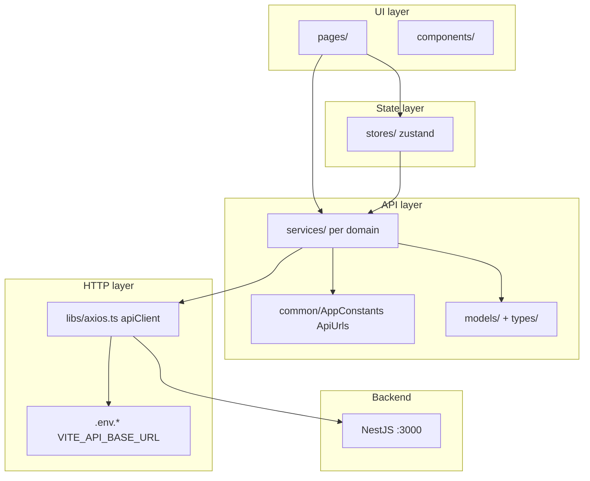

# Zentro frontend — backend API integration architecture

This document is the step-by-step integration plan for connecting **`frontend/myapp`** to the NestJS API in **`backend/myapp`**. Work is organized as **user stories** by phase. Complete phases in order unless your team explicitly parallelizes after Phase 2.

**Per-phase implementation context (what was built, key files, verify commands):** [`phases/README.md`](./phases/README.md) · [`docs/README.md`](./README.md)

**Authoritative API reference:** [`backend/myapp/docs/api-reference.md`](../../backend/myapp/docs/api-reference.md)  
**Interactive API docs:** `http://localhost:3000/reference` (Scalar), `http://localhost:3000/swagger`

---

## Environment configuration (current state)

### `.env.development` (as committed)

```env
# API
VITE_BACKEND_API_URL=http://localhost:3000/api/v1
```

### What the frontend code actually expects

| Source | Variable | Used by |
|--------|----------|---------|
| `.env.development` | `VITE_BACKEND_API_URL` | **Not read** by app code today |
| `.env.production` | `VITE_API_BASE_URL` | `src/libs/axios.ts`, `src/vite-env.d.ts` |
| `src/libs/axios.ts` | `import.meta.env.VITE_API_BASE_URL` | Axios `baseURL` |

### What the backend actually exposes

The Nest app in `backend/myapp/src/main.ts` listens on **port 3000** and does **not** register a global prefix such as `/api/v1`. Routes are rooted at the server origin, for example:

- `POST http://localhost:3000/auth/login`
- `GET http://localhost:3000/products`

**Recommended development base URL (align env + axios):**

```env
# API — full origin; paths like /auth/login are appended by axios + AppConstants.ApiUrls
VITE_API_BASE_URL=http://localhost:3000
```

Use one env variable name everywhere (`VITE_API_BASE_URL`) so development and production behave the same.

---

## Target frontend architecture (integration layers)



| Layer | Responsibility |
|-------|----------------|
| **HTTP** (`libs/axios.ts`) | Base URL, JSON headers, JWT attachment, 401 handling |
| **Constants** (`common/AppConstants.ts`) | Route paths and relative API paths (no hard-coded URLs in components) |
| **Models** (`models/`, `types/`) | Request/response TypeScript shapes matching backend JSON |
| **Services** (`services/`) | One module per domain; thin wrappers over `apiClient` |
| **Stores** (`stores/`) | Auth session, optional UI state; call services, do not call axios directly from pages |
| **Pages** | Forms, tables, navigation; use stores/services and shared UI |

---

## Known gaps to fix in Phase 2+

1. ~~**Env / base path / CORS / axios / tokens / ApiUrls**~~ — **Fixed in Phase 0–1**.
2. ~~**Refresh token flow:** Silent refresh on 401 (Phase 2 US-2.3).~~
3. ~~**Register / change-password UI** (Phase 2 US-2.2, US-2.4).~~

---

## Phase 0 — Prerequisites and verification ✅

> **Status:** Complete. Context: [`phases/00-prerequisites.md`](./phases/00-prerequisites.md) · Runbook: [`dev-setup.md`](./dev-setup.md).

**Cross-origin decision:** **Option A — NestJS CORS** in `backend/myapp/src/main.ts` (not a Vite proxy). Dev origins: `localhost:5173`, `127.0.0.1:5173`, `localhost:4173`. Production: set `CORS_ORIGINS` + `VITE_API_BASE_URL` at build time.

### US-0.1 — Run backend locally

**As a** developer, **I want** the API running on a known host/port **so that** I can verify contracts before wiring the UI.

**Acceptance criteria**

- [x] PostgreSQL and `.env` for `backend/myapp` are configured per backend README/docs (see `.env.example`).
- [x] `pnpm run start:dev` succeeds; health check: `GET http://localhost:3000/` returns the hello response.
- [x] Scalar opens at `http://localhost:3000/reference`.
- [ ] Sample flow works in Scalar: register → login → copy Bearer token → `GET /cart` (manual check with demo user — see [data.md](./data.md)).

---

### US-0.2 — Run frontend locally

**As a** developer, **I want** the Vite app running **so that** I can iterate on integration against the live API.

**Acceptance criteria**

- [x] From `frontend/myapp`: `pnpm dev`.
- [x] App loads at `http://localhost:5173`.
- [x] `VITE_API_BASE_URL=http://localhost:3000` in `.env.development`.

---

### US-0.3 — Document cross-origin strategy

**As a** developer, **I want** a decided approach for browser → API calls **so that** integration is not blocked by CORS.

**Chosen for Zentro**

| Environment | Approach |
|-------------|----------|
| Development | **Option A** — `app.enableCors()` with Vite origins |
| Production | `CORS_ORIGINS` on API; `VITE_API_BASE_URL` on frontend build |

**Acceptance criteria**

- [x] Option A implemented and documented in [`dev-setup.md`](./dev-setup.md).
- [x] Production strategy noted (`CORS_ORIGINS` + `VITE_API_BASE_URL`).

---

## Phase 1 — HTTP client and environment foundation ✅

> **Status:** Complete. Context: [`phases/01-http-foundation.md`](./phases/01-http-foundation.md).

### US-1.1 — Align environment variables

**As a** developer, **I want** a single Vite env variable for the API base URL **so that** axios and TypeScript env types stay in sync across dev and prod.

**Tasks**

- Update `.env.development` to use `VITE_API_BASE_URL=http://localhost:3000` (no `/api/v1` unless backend adds a global prefix later).
- Update `.env.production` to the real deployment origin (e.g. `https://api.zentro.example.com`).
- Extend `src/vite-env.d.ts` if you keep a legacy alias during migration (optional).

**Acceptance criteria**

- [x] `import.meta.env.VITE_API_BASE_URL` is defined in dev and prod builds.
- [x] `apiClient.defaults.baseURL` matches Scalar base (origin only).

---

### US-1.2 — Harden the Axios client

**As a** frontend developer, **I want** one configured `apiClient` **so that** all services share auth, timeouts, and error handling.

**Tasks**

- Fail fast at startup if `VITE_API_BASE_URL` is missing (dev-only warning or thrown error).
- Implement `skipAuth` in the request interceptor: when `config.skipAuth === true`, do not attach `Authorization`.
- On 401: clear tokens, redirect to `/login` (already partially implemented).
- Optionally map Nest validation errors (`message` string or `message: string[]`) to a shared `ApiError` type.

**Acceptance criteria**

- [x] Public routes (`/auth/login`, `/auth/register`, catalog reads if unauthenticated) can omit the Bearer header via `skipAuth`.
- [x] Authenticated requests send `Authorization: Bearer <accessToken>`.

---

### US-1.3 — Unify token persistence

**As a** logged-in user, **I want** my session to survive refresh **so that** protected routes and axios use the same token.

**Recommended approach**

- **Single source of truth:** Zustand `useAuthStore` with `persist`, *or* explicit `localStorage.setItem('access_token', token)` on login and read that key in axios (pick one; avoid both unsynchronized).
- Store **access** and **refresh** tokens from backend field names: `token`, `refreshToken` (see Phase 2).
- On logout: clear store + `clearTokens()` + navigate to login.

**Acceptance criteria**

- [x] After login, `GET /cart` from the browser includes a valid Bearer token (`access_token` in localStorage).
- [x] After page reload, user remains authenticated (Zustand persist + `onRehydrateStorage` syncs tokens).

---

### US-1.4 — Centralize API path constants

**As a** developer, **I want** all relative paths in `AppConstants.ApiUrls` **so that** services do not scatter string literals.

**Initial map (extend as modules are built)**

| Constant key | Path | Auth |
|--------------|------|------|
| `Login` | `/auth/login` | No |
| `Register` | `/auth/register` | No |
| `RefreshToken` | `/auth/refresh-token` | No |
| `ChangePassword` | `/auth/change-password` | Yes |
| `Products` | `/products` | No* |
| `ProductById` | `/products/:id` | No* |
| `Categories` | `/categories` | No |
| `Cart` | `/cart` | Yes |
| `CartItems` | `/cart/items` | Yes |
| `Orders` | `/orders` | Yes |
| `Checkout` | `/orders/checkout` | Yes |
| … | per api-reference.md | … |

\*Confirm per-route auth in Scalar as backend guards evolve.

**Acceptance criteria**

- [x] No raw `/auth/...` strings in page components.
- [x] Path builders for IDs live in `AppConstants.ApiUrlBuilders`.

---

## Phase 2 — Authentication and session ✅

> **Status:** Complete. Context: [`phases/02-authentication.md`](./phases/02-authentication.md).

### US-2.1 — Fix login integration end-to-end

**As a** user, **I want** to log in with email and password **so that** I reach the dashboard with a valid JWT.

**Backend contract (`POST /auth/login`)**

```json
{
  "success": true,
  "message": "Login successful",
  "user": { "id": 1, "email": "...", "name": "...", "role": "user", "status": true },
  "token": "<accessToken>",
  "refreshToken": "<refreshToken>"
}
```

**Frontend tasks**

- Update `LoginRes` (or rename to `AuthTokensResponse`) to match backend.
- Update `services/auth.ts` to return typed data; avoid swallowing errors as `null` without logging—map 401 to invalid credentials.
- Update `useAuthStore.login` to set `token` from `response.token` (not `access_token`).
- Persist user profile in store if needed for nav (`user.name`, `user.role`).

**Acceptance criteria**

- [x] Valid credentials → redirect to `/dashboard`; invalid → inline error.
- [x] Network request URL is `{VITE_API_BASE_URL}/auth/login`.
- [x] Protected route guard (`PrivateRoutes`) and axios both see the same token.

---

### US-2.2 — Registration (optional for MVP)

**As a** new user, **I want** to register **so that** I can log in without using Scalar.

**Tasks**

- Add `services/auth.ts` → `register(name, email, password)` → `POST /auth/register` with `skipAuth: true`.
- Add a register page or modal; wire validation (min password length aligned with backend).

**Acceptance criteria**

- [x] Successful register returns tokens and redirects to dashboard (auto sign-in).

---

### US-2.3 — Refresh token flow

**As a** returning user, **I want** silent token refresh **so that** I am not logged out when the access token expires.

**Tasks**

- Store `refreshToken` from login/register.
- Add `refreshAccessToken()` calling `POST /auth/refresh-token` with body `{ "refreshToken": "..." }`.
- On 401 from a non-auth endpoint, attempt refresh once, retry request, else logout.

**Acceptance criteria**

- [x] Expired access token with valid refresh renews session (axios interceptor + `requestTokenRefresh`).
- [x] Invalid refresh clears session and sends user to login.

---

### US-2.4 — Change password (profile)

**As a** logged-in user, **I want** to change my password **so that** account security is manageable from the app.

**Tasks**

- `POST /auth/change-password` with `{ currentPassword, newPassword }` (JWT required).
- Wire `Profile` page form to service + success/error toasts.

**Acceptance criteria**

- [x] Success message from API surfaced in UI; validation errors shown field-level or global.

---

### US-2.5 — Route guards and logout

**As a** user, **I want** logout and guards **so that** only authenticated users see private pages.

**Tasks**

- `logout()` in store: clear tokens, reset user, `navigate('/login')`.
- Ensure `PrivateRoutes` checks the same token source as axios.
- Optional: decode JWT expiry client-side for proactive refresh (do not trust client for security—server always validates).

**Acceptance criteria**

- [x] Logout removes token from persistence; manual navigation to `/dashboard` redirects to login.

---

## Phase 3 — API layer scaffolding (all domains) ✅

> **Status:** Complete. Context: [`phases/03-api-layer.md`](./phases/03-api-layer.md).

### US-3.1 — TypeScript models per resource

**As a** developer, **I want** shared types for entities and DTOs **so that** services and components are type-safe.

**Tasks**

- Add `src/models/` (or `src/types/api/`) for: `Product`, `Category`, `Customer`, `Supplier`, `Stock`, `Cart`, `CartItem`, `Order`, `OrderItem`, `Payment`, `Purchase`, `Sale`, enums (`ProductType`, `OrderStatus`, `PaymentMethod`, `PaymentStatus`).
- Mirror field names from backend entities and DTO examples in `api-reference.md`.
- Export barrel `models/index.ts`.

**Acceptance criteria**

- [x] Models and enums exported from `models/index.ts`.
- [x] No `any` in service return types for CRUD operations.

---

### US-3.2 — Domain service modules

**As a** developer, **I want** one service file per backend module **so that** pages depend on a stable API surface.

**Suggested files under `src/services/`**

| Service file | Backend area | Priority for storefront |
|--------------|--------------|-------------------------|
| `auth.ts` | `/auth/*` | P0 |
| `products.ts` | `/products` | P0 |
| `categories.ts` | `/categories` | P0 |
| `cart.ts` | `/cart`, `/cart/items` | P0 |
| `cart-items.ts` | `/cart-items/:id` | P0 |
| `orders.ts` | `/orders`, checkout | P0 |
| `payments.ts` | `/payments` | P1 |
| `customers.ts` | `/customers` | P2 (admin) |
| `suppliers.ts` | `/suppliers` | P2 |
| `stock.ts` | `/stocks` | P2 |
| `purchases.ts`, `purchase-items.ts` | purchases | P2 |
| `sales.ts`, `sale-items.ts` | sales | P2 |
| `users.ts` | `/users` | P3 |

**Pattern per function**

```ts
// Example shape — implement per resource
export async function listProducts(): Promise<Product[]> {
  const { data } = await apiClient.get<Product[]>(AppConstants.ApiUrls.Products);
  return data;
}
```

**Acceptance criteria**

- [x] Each service uses `apiClient` only (no `fetch` duplication).
- [x] List/get/create/update/delete names are consistent (`listProducts`, `getProduct`, `createProduct`, …).

---

### US-3.3 — Loading and error UX conventions

**As a** user, **I want** consistent loading and error feedback **so that** API failures are understandable.

**Tasks**

- Use existing `useLoaderStore` for global or per-action loading on mutations.
- Use `components/ui/network-error.tsx` / field errors for recoverable failures.
- Map HTTP status: 400 validation, 401 auth, 403 forbidden, 404 not found, 409 conflict (e.g. duplicate email), 5xx global message.

**Acceptance criteria**

- [ ] Login and at least one CRUD screen demonstrate the pattern for the team to copy.

---

## Phase 4 — Commerce flows (customer-facing) ✅

> **Status:** Complete. Context: [`phases/04-commerce.md`](./phases/04-commerce.md).

### Private routes (storefront)

| Screen | URL | Page component |
|--------|-----|----------------|
| Dashboard (shop home) | `/dashboard` | `pages/Dashboard.tsx` |
| Product catalog | `/products` | `pages/commerce/ProductsPage.tsx` |
| Product detail | `/products/:id` | `pages/commerce/ProductDetailPage.tsx` |
| Categories | `/categories` | `pages/commerce/CategoriesPage.tsx` |
| Cart | `/cart` | `pages/commerce/CartPage.tsx` |
| Checkout | `/checkout` | `pages/commerce/CheckoutPage.tsx` |
| Order history | `/orders` | `pages/commerce/OrdersPage.tsx` |
| Order + payment | `/orders/:id` | `pages/commerce/OrderDetailPage.tsx` |

**Layout:** All private routes render inside `MainLayout` (`AppSidebar` + header with `HeaderCartLink` + `HeaderProfileDropdown`). Cart count loads on layout mount via `useCartStore.fetchCart()`.

**Manual happy path (after `pnpm run seed:demo`):** Login as `shopper@zentro.demo` → `/products` → add item → `/cart` → `/checkout` → place order → `/orders/:id` → pay (COD/Stripe/JazzCash/EasyPaisa). See [`dev-setup.md`](./dev-setup.md) and [`seed.md`](./seed.md).

---

### US-4.1 — Product catalog (browse)

**As a** shopper, **I want** to see active products with categories **so that** I can choose items to buy.

**API:** `GET /products`, `GET /products/:id`, `GET /categories`

**Tasks**

- Service methods with relations returned by backend (category, stock).
- `/products` grid with category filter chips (`?categoryId=`); `/products/:id` detail with stock hints.

**Implemented**

- `ProductCard`, `ProductsPage`, `ProductDetailPage`, `libs/format-money.ts`, `libs/product-stock.ts`.

**Acceptance criteria**

- [x] Only active products shown (backend filters `isActive`; inactive hidden server-side).
- [x] Product detail shows description, SKU, unit, price.

---

### US-4.2 — Shopping cart

**As a** logged-in shopper, **I want** a cart **so that** I can collect items before checkout.

**API:** `GET /cart`, `POST /cart/items`, `PATCH /cart-items/:id`, `DELETE /cart-items/:id`, `DELETE /cart`

**Tasks**

- Zustand `stores/cart.ts`; sync on add/update/remove/clear.
- UI: `HeaderCartLink` badge, `CartPage` line quantities, remove line, clear cart.

**Implemented**

- `addToCart({ productId, quantity })` only — no client price. Cart resets on logout.

**Acceptance criteria**

- [x] Adding product uses server-side price from DB (do not send client price).
- [x] Cart loads for current user only (JWT scoped).

---

### US-4.3 — Checkout and orders

**As a** shopper, **I want** to checkout **so that** my order is created from the cart.

**API:** `POST /orders/checkout`, `GET /orders`, `GET /orders/:id`, `PUT /orders/:id/status`, `DELETE /orders/:id`

**Tasks**

- `CheckoutPage` calls `checkout()` (`POST /orders/checkout`); empty cart shows `CommercePageState`.
- `OrdersPage` lists orders with `StatusBadge`; `OrderDetailPage` shows line items.

**Acceptance criteria**

- [x] Successful checkout clears cart items server-side and shows new order.
- [x] Order detail lists line items with price snapshot.

---

### US-4.4 — Payments

**As a** shopper, **I want** to pay for an order **so that** payment status is tracked.

**API:** `POST /payments`, `GET /payments`, `PUT /payments/:id/status`

**Tasks**

- Payment method enum: `cod`, `stripe`, `jazzcash`, `easypaisa`.
- `OrderDetailPage`: select method → `createPayment({ orderId, method })` → show status via `CommercePageState` / `FieldError`.

**Acceptance criteria**

- [x] Payment tied to owned order only; 403/404 handled gracefully.

---

## Phase 5 — Admin / inventory (back-office) ✅

> **Status:** Complete. Context: [`phases/05-admin.md`](./phases/05-admin.md).

**Login as admin:** `admin@zentro.demo` / `ShopDemo123!` — sidebar **Admin** section and `/admin/*` routes are hidden for `user` role.

### Admin routes

| Screen | URL | Page |
|--------|-----|------|
| Categories CRUD | `/admin/categories` | `AdminCategoriesPage` |
| Products CRUD | `/admin/products` | `AdminProductsPage` |
| Stock | `/admin/stock` | `AdminStockPage` |
| Suppliers | `/admin/suppliers` | `AdminSuppliersPage` |
| Purchases | `/admin/purchases` | `AdminPurchasesPage` |
| Sales (POS) | `/admin/sales` | `AdminSalesPage` |
| Customers | `/admin/customers` | `AdminCustomersPage` |
| Users | `/admin/users` | `AdminUsersPage` |

Non-admin users hitting `/admin/*` are redirected to `/dashboard`.

---

### US-5.1 — Categories CRUD

**As an** admin, **I want** to manage categories **so that** products stay organized.

**API:** `/categories` full CRUD per api-reference.

**Acceptance criteria**

- [x] List with products relation optional in UI; create/edit forms use DTO shape `{ name, description }`.

---

### US-5.2 — Products CRUD

**As an** admin, **I want** to create and edit products **so that** the catalog stays current.

**API:** `POST/PUT/DELETE /products` (delete = soft deactivate).

**Acceptance criteria**

- [x] `type` enum: `goods`, `service`, `digital`.
- [x] `categoryId` selector from categories service.

---

### US-5.3 — Suppliers, stock, purchases

**As an** inventory manager, **I want** supplier and stock management **so that** purchasing reflects warehouse reality.

**API:** `/suppliers`, `/stocks`, `/purchases`, `/purchase-items`

**Acceptance criteria**

- [x] Create purchase with nested `items[]`; totals computed server-side.
- [x] Stock entries linked to `productId` and `location`.

---

### US-5.4 — Sales (POS-style)

**As a** cashier, **I want** to record sales with line items **so that** revenue is tracked separately from online orders.

**API:** `/sales`, `/sale-items`

**Acceptance criteria**

- [x] Create sale with nested items; server recalculates total.

---

### US-5.5 — Customers and users (admin)

**As an** admin, **I want** customer and user management **so that** B2B/B2C accounts are maintained.

**API:** `/customers`, `/users` (confirm auth requirements on each route in Scalar).

**Acceptance criteria**

- [x] CRUD screens behind role guard (`AdminRoutes` + `roles: ['admin']` on menu).

**Implemented:** `AdminCustomersPage`, `AdminUsersPage` at `/admin/customers`, `/admin/users`.

---

## Phase 6 — Routing, layout, and navigation ✅

> **Status:** Complete. Context: [`phases/06-routing.md`](./phases/06-routing.md) · Route map: [`routes.md`](./routes.md).

### US-6.1 — Expand `AppRoutes` for new features

**As a** user, **I want** clear URLs for catalog, cart, orders, and admin **so that** the app is navigable.

**Tasks**

- Extend `AppConstants.Routes` with Private routes: e.g. `/products`, `/cart`, `/orders`, `/orders/:id`, admin section.
- Register routes under `PrivateRoutes` + `MainLayout`.
- Sidebar/nav links in `AppSidebar` / `MenuData.ts`.

**Done**

- [x] `AppConstants.Routes.Private.*` and `RouteBuilders.product` / `RouteBuilders.order`.
- [x] Commerce routes in `routes/AppRoutes.tsx`; private `*` → `/dashboard`.
- [x] `MenuData.ts` catalog + orders + admin submenu; header cart link.
- [x] Admin URLs under `/admin/*` (including customers + users) with `AdminRoutes` role guard.
- [x] `RootRedirect` for `/` and global `*` (dashboard if authenticated, else login).
- [x] `NestingNav` active state for detail routes (`/products/:id`, `/orders/:id`).

**Acceptance criteria**

- [x] Storefront and admin deep links work; unauthenticated access redirects to login.
- [x] Non-admin users cannot access `/admin/*`.
- [x] Full route table documented in [`routes.md`](./routes.md).

---

### US-6.2 — Role-based UI (future-ready)

**As an** admin, **I want** menus hidden by role **so that** shoppers do not see back-office screens.

**Tasks**

- Read `user.role` from auth store after login.
- Gate admin route group (optional until backend enforces roles on APIs).

**Implemented**

- `common/Roles.ts`: `user` (default shopper), `admin` (back-office).
- `useFilteredMenu` filters `MenuItem.roles`; `useIsAdmin` / `AdminRoutes` gate `/admin/*`.

**Acceptance criteria**

- [x] Documented role strings match backend (`user.role` default `'user'`).

---

## Phase 7 — Production, quality, and observability ✅

> **Status:** Complete. Context: [`phases/07-production.md`](./phases/07-production.md) · [`production.md`](./production.md) · [`regression.md`](./regression.md) · CI: [`.github/workflows/ci.yml`](../../.github/workflows/ci.yml)

### US-7.1 — Production build and env

**As a** release engineer, **I want** production env injected at build time **so that** the SPA talks to the correct API.

**Implemented**

- `.env.production` — `VITE_API_BASE_URL` (required at build)
- `scripts/verify-production-build.mjs` — build + assert API URL in `dist/assets/*.js`
- `getApiBaseUrl()` throws if production build lacks `VITE_API_BASE_URL`
- GitHub Actions `frontend-build` job sets `VITE_API_BASE_URL` and runs `verify:build`

**Acceptance criteria**

- [x] CI sets `VITE_API_BASE_URL` for production builds.
- [x] Smoke test: login + authenticated flows via `verify:regression` (local or `API_BASE=staging`).

---

### US-7.2 — Contract testing / manual regression checklist

**As a** QA engineer, **I want** a repeatable test list **so that** integrations do not regress.

**Automated** (`scripts/verify-regression.mjs`):

1. Login / refresh / invalid credentials  
2. List products → add to cart → checkout → pay (COD)  
3. Admin: create category → product → stock  
4. Validation error on bad DTO (400)  
5. 401 on `GET /cart` without JWT  

**Manual** — full UI matrix in [`regression.md`](./regression.md).

**Acceptance criteria**

- [x] Repeatable checklist documented with auto/manual columns.
- [x] CI `api-regression` job runs script against seeded API.

---

---

## Demo database seed (shop look & feel)

Use the backend seeder **before** wiring catalog/cart UI so lists, stock badges, and order history are populated on first paint.

| Item | Detail |
|------|--------|
| **Full reference** | [`seed.md`](./seed.md) · [`backend/myapp/docs/data.md`](../../backend/myapp/docs/data.md) |
| **Script** | `backend/myapp/scripts/seed-shop-demo.ts` |
| **Commands** | `pnpm run seed:demo` · `pnpm run seed:demo:fresh` · `pnpm run verify:seed` |
| **Prerequisite** | PostgreSQL up (`docker compose up -d db`); tables via seed or API (`synchronize: true`) |

### What gets inserted (end-to-end shop narrative)

| Data | Contents |
|------|----------|
| **Users** | `shopper@zentro.demo` (shopper), `admin@zentro.demo` (admin) — password `ShopDemo123!`, `status: true` |
| **Categories** | Grocery, Beverages, Electronics, Personal Care |
| **Products** | 12 items (rice, dal, oil, milk, juice, water, earbuds, cable, shampoo, soap, gift wrap service, e-gift card) |
| **Stock** | Per-product quantities and locations (includes low-stock milk/soap for UI alerts) |
| **Supplier + purchase** | Metro Wholesale + inbound rice/oil lines |
| **Sale** | One completed POS-style earbuds sale |
| **Customers** | Two B2B-style customer records |
| **Cart (shopper)** | 1× earbuds + 2× mango juice |
| **Orders (shopper)** | Order #1 confirmed + COD payment success; Order #2 pending, unpaid |

**Verify seed** (API must be running):

```bash
cd backend/myapp
pnpm run seed:demo          # or seed:demo:fresh to reset
pnpm run start:dev          # separate terminal
cd ../../frontend/myapp
pnpm run verify:seed
```

**Acceptance criteria**

- [x] `GET /products` returns multiple categories and realistic names/prices.
- [x] Login as `shopper@zentro.demo` → `GET /cart` shows two lines; `GET /orders` shows two orders.
- [x] `GET /stocks` shows varied quantities for dashboard widgets.

---

## Phase 8 — Nice-to-have enhancements (optional)

> **Status:** Partial (i18n done). Context: [`phases/08-enhancements.md`](./phases/08-enhancements.md).

Implement after Phases 0–7 when core flows are stable. None of these block MVP.

### US-8.1 — Product search and filters

**As a** shopper, **I want** to search and filter by category and price **so that** I can find products quickly.

**Acceptance criteria**

- [ ] Search debounced on name/SKU; category chips; optional price range.
- [ ] Empty state when no matches.

---

### US-8.2 — Product images and rich cards

**As a** shopper, **I want** product photos and short highlights **so that** the catalog feels polished.

**Acceptance criteria**

- [ ] Image URL on product model (backend field or CDN placeholder strategy).
- [ ] Grid cards show image, price, unit, stock hint (in stock / low / out).

---

### US-8.3 — Wishlist / save for later

**As a** shopper, **I want** to save products without adding to cart **so that** I can compare before buying.

**Acceptance criteria**

- [ ] Persisted per user (local or API); move to cart in one action.

---

### US-8.4 — Order tracking timeline

**As a** shopper, **I want** a visual status timeline **so that** I know where my order stands.

**Acceptance criteria**

- [ ] Steps for `pending` → `confirmed` → paid; cancelled state distinct.

---

### US-8.5 — Notifications (toast + optional email)

**As a** user, **I want** feedback on cart/checkout/errors **so that** actions feel confirmed.

**Acceptance criteria**

- [ ] Toasts on add-to-cart, checkout success, payment update.
- [ ] Optional: email on order confirmed (backend hook later).

---

### US-8.6 — Dark mode and theme tokens

**As a** user, **I want** light/dark theme **so that** the shop is comfortable at night.

**Acceptance criteria**

- [ ] Theme toggle; Tailwind/CSS variables; preference persisted.

---

### US-8.7 — Pagination and virtualized lists

**As a** user browsing large catalogs, **I want** fast lists **so that** scrolling stays smooth.

**Acceptance criteria**

- [ ] Server or client pagination on products/orders; virtualized table for admin.

---

### US-8.8 — Admin dashboard analytics

**As an** admin, **I want** sales/stock/low-inventory widgets **so that** I see business health at a glance.

**Acceptance criteria**

- [ ] Cards: total products, low stock count, recent orders, revenue from sales/orders APIs.

---

### US-8.9 — Export (CSV / PDF)

**As an** admin, **I want** to export orders and stock **so that** I can report offline.

**Acceptance criteria**

- [ ] CSV download for current list filters; basic PDF receipt for an order.

---

### US-8.10 — Multi-language (i18n) ✅

**As a** user, **I want** English/Urdu (or other) UI **so that** the app is accessible locally.

**Acceptance criteria**

- [x] **i18next** + **react-i18next** (replaces `react-intl`) — nested JSON in `src/locales/en.json` and `src/locales/ur.json`; init in `src/libs/i18n.ts`.
- [x] Thin `useT()` hook (`src/hooks/use-t.ts`) — `t(id, defaultMessage?, values?)` across shell, commerce, admin, and auth.
- [x] **Language switcher** (EN / اردو) in `MainLayout` header; locale persisted in `localStorage` (`zentro-locale`); Urdu sets `dir="rtl"` on `<html>`.

---

### US-8.11 — PWA / offline shell

**As a** mobile shopper, **I want** installable app behavior **so that** I can reopen the shop quickly.

**Acceptance criteria**

- [ ] Web manifest + service worker for static assets; clear offline banner when API unreachable.

---

### US-8.12 — OpenAPI client codegen

**As a** developer, **I want** generated types from `api.json` **so that** services stay in sync with the API.

**Acceptance criteria**

- [ ] Script regenerates client on backend OpenAPI change; CI check optional.

---

### US-8.13 — TanStack Query (server state)

**As a** developer, **I want** cached server state **so that** cart and lists refetch intelligently.

**Acceptance criteria**

- [ ] Query keys per resource; mutations invalidate cart/orders; stale-time tuned per screen.

---

### US-8.14 — E2E tests (Playwright)

**As a** team, **I want** automated happy-path tests **so that** releases do not break checkout.

**Acceptance criteria**

- [ ] Seed data + login + add to cart + checkout run in CI against test DB.

---

### US-8.15 — Rate limiting and request ID (observability)

**As an** operator, **I want** traceable requests **so that** I can debug production issues.

**Acceptance criteria**

- [ ] Correlation id header from frontend; optional Sentry on FE/BE.

---

## Suggested implementation order (summary)

```text
Phase 0  → Backend + frontend running, CORS/proxy decided
Phase 1  → Env (VITE_API_BASE_URL), axios, tokens, AppConstants paths ✅
Phase 2  → Login/register/refresh/profile password aligned with backend JSON ✅
Phase 3  → Models + service stubs for all domains ✅
Phase 4  → Catalog → cart → checkout → orders → payments ✅
Phase 5  → Admin: categories, products, inventory, purchases, sales ✅
Phase 6  → Routes + navigation ✅
Phase 7  → Production env + regression checklist ✅
Seed     → pnpm run seed:demo + verify:seed — see seed.md ✅
Phase 8  → Nice-to-have (i18n ✅; search, images, analytics, PWA, E2E, …)
```

---

## Quick reference — your `.env.development` lines 1–2

```env
# API
VITE_BACKEND_API_URL=http://localhost:3000/api/v1
```

**After Phase 1 alignment, prefer:**

```env
# API (NestJS — no /api/v1 prefix today)
VITE_API_BASE_URL=http://localhost:3000
```

---

## Related documentation

| Document | Location |
|----------|----------|
| **Docs index** | `frontend/docs/README.md` |
| **Branding (favicon, auth, sidebar)** | `frontend/docs/branding.md` |
| **UI refactor plan** | `frontend/docs/ui-refactor-plan.md` |
| **Phase context (all phases)** | `frontend/docs/phases/README.md` |
| Phase 0 dev setup | `frontend/docs/dev-setup.md` |
| Route map + role visibility | `frontend/docs/routes.md` |
| Demo seed (full guide) | `frontend/docs/seed.md` |
| Demo users quick ref | `frontend/docs/data.md` |
| API endpoints & examples | `backend/myapp/docs/api-reference.md` |
| Backend modules & conventions | `backend/myapp/docs/backend-architecture.md` |
| Demo seed guide | `frontend/docs/seed.md` |
| Demo DB tables (backend) | `backend/myapp/docs/data.md` |
| Axios client | `frontend/myapp/src/libs/axios.ts` |
| Auth service | `frontend/myapp/src/services/auth.ts` |
| Cart store | `frontend/myapp/src/stores/cart.ts` |
| Commerce pages | `frontend/myapp/src/pages/commerce/` |
| Admin pages | `frontend/myapp/src/pages/admin/` |
| Admin route guard | `frontend/myapp/src/routes/AdminRoutes.tsx` |
| Route constants | `frontend/myapp/src/common/AppConstants.ts` |
| Sidebar menu | `frontend/myapp/src/common/MenuData.ts` |
| Brand assets barrel | `frontend/myapp/src/assets/index.ts` |
| Auth page layout | `frontend/myapp/src/components/layouts/AuthPageLayout.tsx` |
| Brand logo component | `frontend/myapp/src/components/ui/BrandLogo.tsx` |
| Production deploy | `frontend/docs/production.md` |
| Regression checklist | `frontend/docs/regression.md` |
| CI workflow | `.github/workflows/ci.yml` |

**Phases 0–7 are complete.** **US-8.10 (i18n)** is done — use the header language switcher to test EN/Urdu. Run **`pnpm run seed:demo`**, UI smoke tests in [dev-setup.md](./dev-setup.md), then **`pnpm run verify:regression`** and **`pnpm run verify:build`**. Optional next: **Phase 8** remainder (search, E2E, PWA, …).
