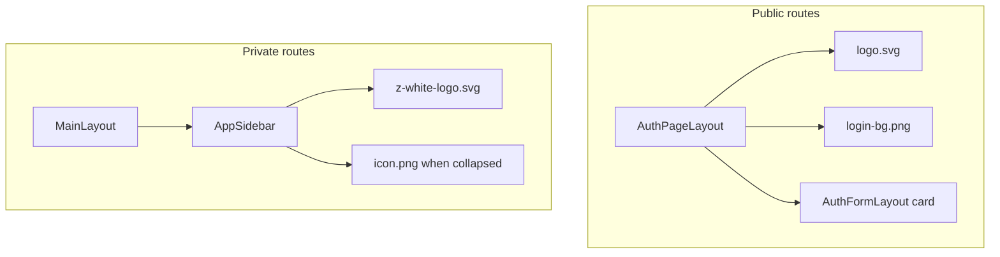

# Branding — favicon, logos, auth layout, sidebar

**Status:** ✅ Sprints A–C complete (favicon, sidebar logo, auth pages).

This document describes the Zentro brand assets, where they live in the repo, and which layout components use them.

---

## Asset inventory

| Asset | Path | Use |
|-------|------|-----|
| Login background | `src/assets/bg/login-bg.png` | Full-screen auth pages |
| App icon (PNG) | `src/assets/icons/icon.png` | Favicon fallback, sidebar collapsed, Apple touch icon |
| App icon (SVG) | `src/assets/icons/icon.svg` | Favicon (scalable) |
| Color wordmark | `src/assets/logos/logo.svg` | Auth pages (above form card) |
| White wordmark | `src/assets/logos/z-white-logo.svg` | Sidebar header (expanded) |

**Central imports** — use `@/assets` barrel:

```ts
import { loginBg, brandIcon, brandIconSvg, logoColor, logoWhite } from '@/assets';
```

Defined in `src/assets/index.ts`.

---

## Sprint A — Favicon & app metadata ✅

### Public files (`frontend/myapp/public/`)

| File | Source |
|------|--------|
| `favicon.svg` | `src/assets/icons/icon.svg` |
| `favicon.png` | `src/assets/icons/icon.png` |
| `apple-touch-icon.png` | `src/assets/icons/icon.png` |

### `index.html`

- Title: **Zentro**
- Meta description for SEO
- Favicon links (SVG + PNG + Apple touch)
- Removed default Vite `vite.svg`

**Verify:** Browser tab shows circular Z icon; title is not "Seed React".

---

## Sprint B — Sidebar logo ✅

### `BrandLogo` (`src/components/ui/BrandLogo.tsx`)

| Prop | Default | Behavior |
|------|---------|----------|
| `variant` | `'white'` | `'white'` → `logoWhite`; `'color'` → `logoColor` |
| `collapsed` | `false` | `true` → circular `brandIcon` only |
| `className` | — | Size overrides (e.g. auth uses `h-12`) |

### `AppSidebar` (`src/components/layouts/AppSidebar.tsx`)

- **Expanded:** white wordmark (`z-white-logo.svg`), `h-8`, max-width constrained
- **Collapsed:** circular icon (`icon.png`), centered
- **Mobile drawer:** full wordmark + close button

Replaces previous text placeholders `"Zentro"` / `"Z"`.

---

## Sprint C — Auth page layout ✅

### `AuthPageLayout` (`src/components/layouts/AuthPageLayout.tsx`)

Shared wrapper for public auth routes:

```
login-bg.png (full viewport, object-cover)
  + subtle overlay (bg-black/15)
  + LanguageSwitcher (top-right)
  + BrandLogo variant="color" (logo.svg, h-12)
  + children (typically AuthFormLayout card)
```

### `AuthFormLayout` (`src/pages/accounts/AuthFormLayout.tsx`)

- Frosted white card: `bg-white/95`, `shadow-xl`, `backdrop-blur-sm`
- Title, subtitle, form body, optional footer links

### Pages using `AuthPageLayout`

| Page | Path |
|------|------|
| Login | `src/pages/accounts/LoginPage.tsx` |
| Register | `src/pages/accounts/RegisterPage.tsx` |
| Forgot password | `src/pages/accounts/ForgotPasswordPage.tsx` |

**Removed:** `LoginBanner.tsx` (broken paths to `@/assets/images/...`; replaced by `AuthPageLayout`).

**Legacy:** `LayoutCenter` (`src/components/layouts/LayoutCenter.tsx`) — cream `bg-page-gradient`; still available for non-auth centered pages but **not** used by auth anymore.

---

## Layout map



---

## Manual QA checklist

| # | Check | Expected |
|---|--------|----------|
| B1 | Browser tab icon | Circular Z (not Vite logo) |
| B2 | Tab title | `Zentro` |
| B3 | `/login`, `/register`, `/forgot-password` | Dark `login-bg` full screen |
| B4 | Auth pages | Color `logo.svg` above white form card |
| B5 | Language switcher on auth | Top-right; EN / اردو works |
| B6 | Sidebar expanded (admin) | White Zentro wordmark |
| B7 | Sidebar collapsed | Circular icon only |
| B8 | Mobile menu | Wordmark + close (X) |
| B9 | `pnpm run verify:build` | Passes; assets in `dist/assets/` |

---

## Planned next (not in Sprints A–C)

From [ui-refactor-plan.md](./ui-refactor-plan.md):

- Primary button gradient using `#1F150C`
- Form field validation UI (red border + error pill)
- `Select` / `MultiSelectDropdown` in admin forms
- DataTable vertical-dots action menu
- Global `SuspenseLoading` + `react-hot-toast` on submit

---

## Related files

| File | Role |
|------|------|
| `index.html` | Favicon + title |
| `public/favicon.*` | Static favicon assets |
| `src/assets/index.ts` | Asset barrel exports |
| `src/components/ui/BrandLogo.tsx` | Logo component |
| `src/components/layouts/AuthPageLayout.tsx` | Auth shell |
| `src/components/layouts/AppSidebar.tsx` | Sidebar branding |
| `src/pages/accounts/AuthFormLayout.tsx` | Form card |

---

## Related docs

- [phases/02-authentication.md](./phases/02-authentication.md) — auth flows
- [phases/06-routing.md](./phases/06-routing.md) — layouts & sidebar
- [ui-refactor-plan.md](./ui-refactor-plan.md) — broader UI migration
- [regression.md](./regression.md) — QA including branding checks
